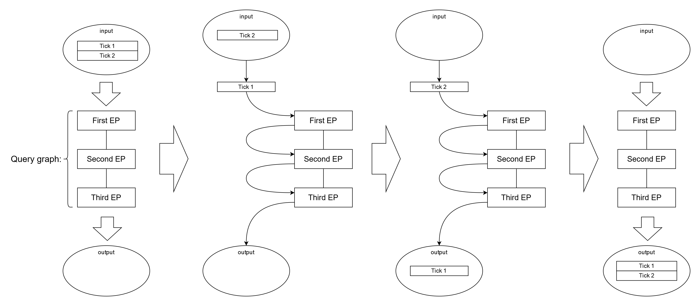

How Onetick analytical engine works
***********************************

Onetick.py is a tool that **builds Onetick queries**. Most of the code written in onetick.py will create a query,
represented by :class:`onetick.py.Source` object, and then using :func:`onetick.py.run` function
would execute the created query using the Onetick analytical engine.

For simple queries, the data processing is straightforward. However, writing complex queries with good performance
often requires understanding how query would be executed by the Onetick analytical engine.
In this document, we'll discuss how data is represented and processed by Onetick.

Onetick tick processing
=======================

All data flowing through Onetick query is represented as a sequence of data records, or **ticks**.
Each tick would contain fields with different types: integers, floats, strings, etc.

Onetick represents the logic of a query as a graph of operations, that are called **Event Processors** (EPs).
Each EP represents an operation that is applied to ticks. It may be a simple operation like adding a field,
or a filter that would remove some ticks, or some other operation.
Onetick.py would represent each function that is applied to :class:`otp.Source <onetick.py.Source>` as one or several EPs
that would be attached to the graph. Below, we will talk about individual EPs.

Onetick is a time-series database, thus ticks always carry a timestamp, and are in almost all situations
ordered by time in an ascending order: earlier ticks come before later ticks.

You can imagine that the processing happens in the following way:
Onetick analytical engine inserts ticks into the graph from the top of the graph,
according to the data sources defined in the graph. Then, ticks pass through the graph from top to
bottom, and the EPs through which ticks pass are being applied to the ticks.
This means that EPs higher in the graph are applied to ticks **before** EPs lower in the graph.

Normally, ticks are being processed one by one, from earliest to latest. This means that:

1) First tick will be put into the graph, will pass from top to bottom, and will be stored for output
2) Then, second tick will be put into the graph, will pass from top to bottom, and will be stored for output
3) Then, third tick will be put into the graph, etc.

This approach ensures that even if the total amount of ticks being processed is very large,
Onetick only deals with a small subset of overall data set at each particular moment:
in the best scenario, only a single tick.

Input ticks will typically be read from its input (it may be an archive on disk, or a remote server)
in small chunks, such that all input is never held in memory at once.
However, query **output** ticks will be held in memory until they can be returned to the caller as a Pandas Dataframe.
Large output size is a typical reason for a high memory consumption of Onetick queries.

Tick accumulation in Onetick
============================

However, some Onetick EPs will cause **tick accumulation**. This means that some amount of ticks will get
accumulated in that EP before being propagated to the lower part of the graph.

.. image:: images/onetick_data_processing_tick_accumulation.svg
   :width: 150%

Tick accumulation is one of the main reasons for performance degradation in Onetick, so we will look in
more details at when it happens and why.

Onetick EPs can be roughly divided into those that do not accumulate ticks, and those
that accumulate ticks. Also, the same EP may accumulate or not accumulate ticks, depending on its
configuration.

Most often, Onetick EP will accumulate as many ticks as necessary for the implementation of requested logic.
Usual cases include:

- Adding or updating a field based on other fields of ticks will not cause tick accumulation
- Adding a field based on values of **next** tick will lead to accumulation of 1 tick (as current tick cannot be propagated to the output before next input tick arrived)
- Sorting ticks by the value of some field using :meth:`onetick.py.Source.sort` method (that uses **ORDER_BY** EP)
  will cause this operation to accumulate **all** input ticks, as they need to be re-sorted.
- "Naive" update of timestamp by changing value of 'Time' column of :class:`otp.Source <onetick.py.Source>`
  will cause accumulation of **all** input ticks, as ticks need to be re-sorted according to the new timestamp.
  There's a special method :meth:`onetick.py.Source.update_timestamp` that can be used to update timestamps
  without tick accumulation, or with limited tick accumulation. This method uses **UPDATE_TIMESTAMP** EP.
- Aggregations will not typically cause tick accumulation, as they are only tracking aggregated values
  (sums, tick counts, etc.) and internally update these values on each coming tick.
- :func:`onetick.py.join` (that uses **JOIN** EP) will normally cause accumulation of **all** input ticks,
  because it will need to store internally all the ticks from both input sources before it is able to join them.
  However, with some join conditions, tick accumulation at joining may be limited.

Typically, accumulating a small number of ticks in the EP will not lead to a significant performance
degradation. Therefore, the operations that can lead to high memory consumption, if applied to a large
number of ticks, are:

- :meth:`onetick.py.Source.sort`
- naive timestamp reassignment
- :func:`onetick.py.join` with a general condition

Aggregations in Onetick
=======================

As mentioned above, aggregations in Onetick will not typically cause tick accumulation,
as they are only tracking aggregated values (sums, tick counts, etc.) and internally update these values
on each coming tick. However, aggregations will delay propagation of output ticks
until after the aggregation was fully calculated for the time window / bucket.

On the diagram below, an aggregation EP **NUM_TICKS** (:meth:`onetick.py.agg.count`) is used to illustrate
how aggregations work in Onetick. This example assumes the aggregation bucket to include the whole time range.

.. image:: images/onetick_data_processing_aggregation.svg
   :width: 150%

If an aggregation uses buckets with fixed size, then output tick for a bucket will be created as soon as input
for that bucket is fully processed (which means that an input tick belonging to the next bucket arrived).

However, for **running** aggregations output ticks will be created on each input tick:
there will be no delay on output propagation.

Also, note that amount of intermediate values that Onetick would keep in memory while doing the aggregation
would depend on `group_by` parameter of the aggregation. For example, if the aggregation counts number of order ticks
per each unique order ID, you should expect such aggregation to use a lot of memory, since it will need
to keep intermediate count for each unique ID it encounters.

State variables
===============

State variables are values that are tied not to the ticks that are passing through the query, but to the query itself.
They reflect “state” of the query, and usually change as the ticks are passing through the query.

State variables can be simple objects (e.g. an integer value or a string),
and they can be tick containers capable of holding ticks inside them (e.g. a tick set, or a tick list).
Tick sets in particular are very useful in situations
where you need to keep intermediate information as key-value pairs.

There are two common operations that can be done with state variables:

1. When a state variable is declared, it has an initial value assigned to it.
   State value initialization happens before any ticks are propagated through the query.
   If :func:`onetick.py.eval` is used to initialize a state variable (for example, a tick set),
   then the query in :func:`onetick.py.eval` will be executed before the main query,
   and its results would be stored in the state variable.
2. When some EP accesses a state variable to read or modify its value,
   variable access or modification happens when an input tick is passing through this EP.
   Therefore, most operations done to state variables (other than initialization)
   are triggered by tick passage through the query.
   So, to know which value the state variable will hold for a particular tick,
   it’s important to understand the overall order of tick processing.

Depending on the tick accumulation happening in the graph,
results of the operations with state vars may be different!
See the diagrams below to see how a state var would behave with and without tick accumulation.

In the first example, each tick that passes through the graph updates the state variable,
and immediately gets its value assigned to a field:

.. image:: images/onetick_data_processing_state_var_1.svg
   :width: 150%

In the second example, there is an accumulating EP between state variable update and state variable being assigned
to a field, thus state variable gets assigned to tick fields only after **all** ticks updated its value first:

.. image:: images/onetick_data_processing_state_var_2.svg
   :width: 150%
