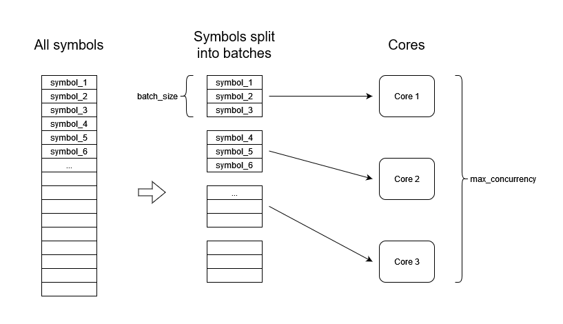
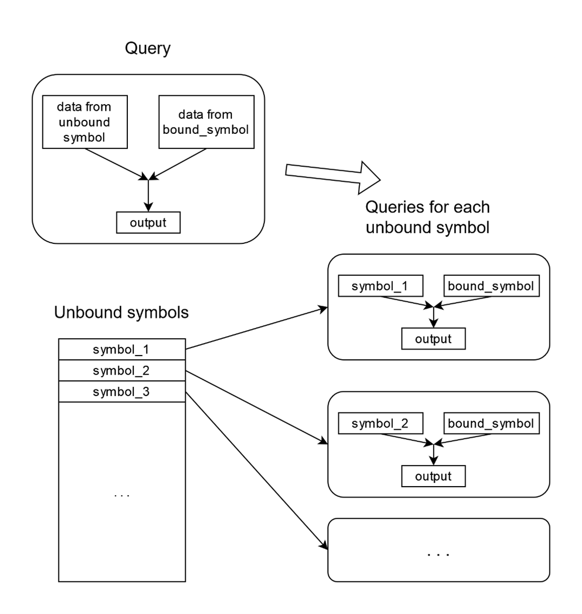
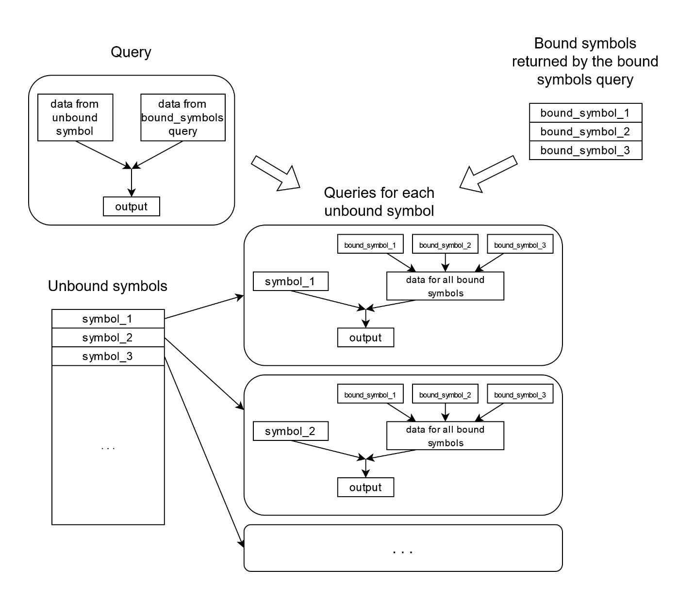
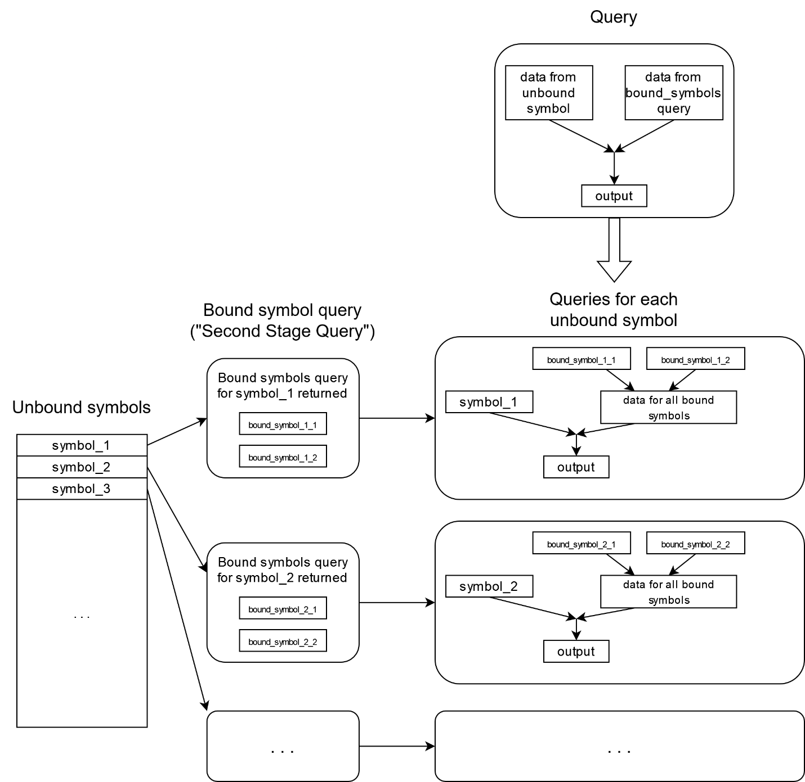

How Onetick parallelizes query execution
****************************************

Performance of Onetick queries usually relies on the calculations being parallelized.
In most cases, parallelization happens across the cores of the same machine, and parallel threads
are performing independent calculations: that is, they do not communicate between each other during their work.
Once all parallel calculations have been performed, their result is picked up and used by Onetick
(for example, propagated to user).

In this article we will review most common scenarios of processing parallelization with Onetick,
and understand how parallelization is controlled.

Symbols and First Stage Query
=============================

Symbols are one of the basic concepts of Onetick data model. Normally, symbols are expected to contain
homogenous and independent data sets (such that structure of data is the same across all symbols).
Uniformity of structure is the main difference between symbols and tick types in Onetick data model,
as tick types are expected to carry differently structured data.

A common example of a symbol is data (for example, order flow) for a single market symbol.

As data sets for different symbols can often be processed fully independently, most of Onetick capabilities
for parallelization rely on parallelizing query execution across multiple symbols for which query should be run.
There are two types of symbol specification for a Onetick query execution:

- Unbound symbols are symbols that are applied to the whole query. The query will execute for each unbound symbol
  independently, and results for different unbound symbols will also be returned independently of each other.
  However, a query will return results only after it processes **all** unbound symbols.
- Bound symbols are symbols that are "bound" to a specific point in the query, such that part of the query graph
  **above** this point is executed for each bound symbol independently, and then data for all bound symbols is
  merged together and propagated to the query graph **below** this point as a single tick stream.

For both bound and unbound symbols, list of symbols can be provided as an explicit list of values.
Usually, however, a separate query is used in place of a symbol list, such that each tick returned by this query
is interpreted as a symbol by the main query. Such separate query is typically called **First Stage Query**, or **FSQ**
when it returns unbound symbols, because it is executed by Onetick before the main query. A separate query
can also return list of bound symbols, and sometimes it may also be referred to as FSQ.

Bound symbols may also depend on unbound symbols, which will be discussed below.

Parallel execution of a query with unbound symbols
==================================================

In case of unbound symbols, parallelization schema is more simple.
When Onetick is running calculations for multiple independent symbols,
it will parallelize it across available resources, if configured to do so.
There are two main query properties that control how Onetick parallelizes calculations:

1. “concurrency” is the number of independent processor cores that will be used by the query,
   if this many cores are available. Default value is :attr:`onetick.py.configuration.Config.default_concurrency`
2. “batch_size” is the number of symbols that will be simultaneously processed together on a single processor core.
   Processing a batch of symbols creates some overhead, so typically it is more efficient
   to process multiple symbols in a batch. On the other hand, large batch sizes may lead to higher memory usage.
   Default value is :attr:`onetick.py.configuration.Config.default_batch_size`

Values of concurrency and batch size can also be passed to the :func:`onetick.py.run` function.

When a query is run across a large number of symbols, Onetick would split all symbols
into batches of :attr:`batch_size`, and run each batch on a separate core,
occupying no more than :attr:`concurrency` cores. When calculation of a batch is finished on a core,
the next batch is dispatched to that core. This continues until all symbols are processed.

Note that `concurrency` and `batch_size` are applied only to the main query, and **not** applied to the FSQ.
The reason for this is that FSQ itself normally lacks unbound symbols to parallelize its execution upon.
Lack of parallelization for FSQ may lead to long execution times for it. Below we will discuss ways to achieve
FSQ parallelization.

Parallel execution of a query with bound symbols
================================================

In the following example, a query has unbound symbol “UNBOUND_SYMBOL”,
but one branch has a different symbol “BOUND_SYMBOL” as bound symbol.
In this branch, ticks will be loaded from “BOUND_SYMBOL”:

.. testcode::

   unbound_branch = otp.DataSource(db='LOCAL', tick_type='TICK_TYPE')
   bound_branch = otp.DataSource(db='LOCAL', tick_type='TICK_TYPE', symbol='BOUND_SYMBOL')
   query = unbound_branch + bound_branch
   otp.run(query, symbols='UNBOUND_SYMBOL')

When a query with bound symbols is executed for a list of unbound symbols, then for each unbound symbol,
data will be loaded for unbound symbol in the branches without bound symbols,
but data will be loaded for bound symbol in the branches with this bound symbol:

Bound symbol list can also be provided by a separate query. In this case (and also if multiple bound symbols
need to be specified as an explicit list), :func:`onetick.py.merge` function should be used. In the following
example, unbound symbols for the whole query would be ``A`` and ``B``, but bound symbols for the bound branch
would be ``AA`` and ``BB``:

.. testcode::

   unbound_branch = otp.DataSource(db='LOCAL', tick_type='TICK_TYPE')
   bound_branch = otp.DataSource(db='LOCAL', tick_type='TICK_TYPE')
   bound_symbols = otp.Ticks(SYMBOL_NAME=['AA', 'BB'])
   bound_branch = otp.funcs.merge([bound_branch], symbols=bound_symbols)
   query = unbound_branch + bound_branch
   first_stage_query = otp.Ticks(SYMBOL_NAME=['A', 'B'])
   otp.run(query, symbols=first_stage_query)

In this case, data in the bound branch will be loaded for all bound symbols and then merged:

Note that bound symbol part of the query will be executed once per each batch of the unbound symbols,
as individual batches are processed independently by Onetick.

If bound symbol part of the query needs to be executed over a large number of symbols,
this execution can be parallelized in a way similar to parallelization of the full query,
by setting :attr:`concurrency` and :attr:`batch_size` parameters of the :func:`onetick.py.merge` function:

.. testcode::

   bound_symbol_list_src = otp.Ticks(SYMBOL_NAME=['AA', 'BB'])

   src = otp.Tick(A=1)  # this part of the query will run
                        # with concurrency=48
                        # and batch_size=10
   src = otp.funcs.merge([src],
                         symbols=bound_symbol_list_src,
                         concurrency=48,
                         batch_size=10)
   src['NEW_FIELD'] = '2'  # this part of the query will run
                           # with concurrency=24
                           # and batch_size=5
   otp.run(src, concurrency=24, batch_size=5)

**Note:** if the bound symbol list does not depend on unbound symbol,
then bound symbol part of the query will be reevaluated **per each batch** of unbound symbols.
In this case, setting batch size to be larger will allow more efficient reuse of the calculations for bound symbols.
If bound symbol list depends on unbound symbol, then bound symbol part will be reevaluated for each unbound symbol.

Also, :attr:`batch_size` and :attr:`concurrency` of the bound symbol part of the query will be applied
to each individual calculation of the unbound part of the query (per each unbound batch or per each unbound symbol).
It means that Onetick will create ``bound_concurrency`` threads **per each unbound thread**
(in which unbound batches are being processed). Thus, total number of threads (and, potentially, CPU cores)
that would be occupied by the bound symbol calculation will be equal to ``unbound_concurrency * bound_concurrency``.

In the diagram below, we assume that:

- bound symbols do not depend on unbound symbols
- ``unbound_batch_size = 3``
- ``unbound_concurrency = 3``
- ``bound_batch_size = 1``
- ``bound_concurrency = 2``

So, there will be up to 6 threads processing bound symbol part of the query at the moment.
However, there will be only 3 threads processing unbound symbol part of the query.

.. image:: images/onetick_parallelization_bound_symbols_concurrency.svg
   :width: 150%

Parallelization across bound symbols can be used to parallelize heavy calculations inside the FSQ.

Bound symbols dependent on unbound symbols
==========================================

In some situations, you may need to merge data from additional symbols for each unbound symbol.
An example: you use underlying symbols as unbound symbols and need to merge data for all derivatives for this underlier.
In this case, Onetick allows to use bound symbol list that depends on the unbound symbol.
Then, the query returning unbound symbol will be executed not once as in previous cases,
but **for each unbound symbol**. Such query is sometimes called “Second Stage Query”.

The bound symbol part of the query will be executed for each unbound symbol as well
(unlike in case of bound symbols independent of unbound symbols,
where bound symbol part of the query gets executed once per each batch):

Using bound symbols that depend on unbound symbols requires special onetick.py syntax.
:func:`onetick.py.eval` should be used to pass symbols to :func:`onetick.py.merge`,
and :func:`onetick.py.eval` call must have an argument called ``symbol``. Usage of this parameter would instruct
onetick.py to use a special Onetick expression when constructing query graph, to tell to Onetick
that bound symbols should depend on unbound symbols.

``symbol`` would normally contain a schema of symbol parameters that are supplied by the FSQ of main query:

.. testcode::
   first_stage_query_src = otp.Ticks(SYMBOL_NAME=['A', 'B', 'C'])

   ssq_src = otp.Ticks(VAL=['1', '2'])
   ssq_src['SYMBOL_NAME'] = ssq_src['_SYMBOL_NAME'] + "_" + ssq_src['VAL']

   src = otp.Tick(A=1)
   src['BOUND_SYMBOL'] = src['_SYMBOL_NAME']

   src = otp.funcs.merge([src], symbols=otp.eval(ssq_src,
                                                 symbol=first_stage_query_src.to_symbol_param()))
   src['UNBOUND_SYMBOL'] = src['_SYMBOL_NAME']

   res = otp.run(src, symbols=first_stage_query_src)
   print(res.keys())
   print(res['A'])
   print(res['B'])
   print(res['C'])

.. testoutput::

   dict_keys(['A', 'B', 'C'])
           Time  A BOUND_SYMBOL UNBOUND_SYMBOL
   0 2003-12-01  1          A_1              A
   1 2003-12-01  1          A_2              A
           Time  A BOUND_SYMBOL UNBOUND_SYMBOL
   0 2003-12-01  1          B_1              B
   1 2003-12-01  1          B_2              B
           Time  A BOUND_SYMBOL UNBOUND_SYMBOL
   0 2003-12-01  1          C_1              C
   1 2003-12-01  1          C_2              C

Note that in onetick.py code, if the source passed to :func:`onetick.py.eval` is a function,
then ``symbol`` object will be passed as a parameter to this function.
But if the source is passed as an :class:`onetick.py.Source` object (as in the example above),
then it does not matter what object is passed as ``symbol`` parameter – Onetick would correctly use unbound symbol
to calculate bound symbols as long as you pass anything. For convenience, the following empty object can be used:

.. testcode::

   src = otp.funcs.merge([src], symbols=otp.eval(ssq_src,
                                                 symbol=otp.Empty().to_symbol_param()))

Other ways of parallelizing Onetick query
=========================================

Some Onetick operations are able to further parallelize their work.
In such cases, required parallelization is usually set as a parameter of that operation,
and is applied on top of "main" parallelization by symbol.
For example, if unbound symbols are processed by 4 threads, and some operation requests using 3 threads for it,
then its total parallelization would be 12 threads (3 threads for each unbound symbol thread).

Examples of such operations:

- :meth:`onetick.py.Source.process_by_group`
- :meth:`onetick.py.Source.join_with_query`

Parallelization of CEP queries
==============================

All the discussion above applied to parallelization of historical (EOD) queries.
If you are running a CEP (real-time) query, the overall model of parallelization will remain the same,
but specifics will be considerably different.

Parallelization of CEP queries is always performed **per unbound symbol**. There's no way to parallelize
execution further (as in case of bound symbols), since synchronous, real-time processing of the query for unbound symbol
has to be performed in the same thread.

Thus, all the unbound symbols of a CEP query would be distributed between threads, and each thread would run
its assigned unbound symbols in real-time. Any bound symbol parts that the query may have would be processed in the same
thread as the unbound symbol.

Moreover, for CEP queries, ``concurrency`` and ``batch_size`` parameters of :func:`onetick.py.run` are **ignored**.
Instead, number of threads used by the query would depend on the parameters of CEP adapter for the input database.
Onetick allows to use different CEP adapters, each adapter corresponding to its own type of real-time input:
for example, it may be a data feed, or a growing raw data file, or something else. Most CEP adapters would define
two configurations for number of used threads:

- ``threads_for_symbols_bound_to_query``
- ``threads_for_symbols_bound_to_ep``

The first parameter controls how many threads the adapter would use to dispatch input data to CEP queries
with unbound symbols. The second parameter controls how many threads the adapter would use to dispatch input data
to CEP queries with bound symbols. However, data dispatching and query analytics have to occur in the same thread -
therefore, same number of threads would be used to parallelize query analytics.

There are three important notes:

1.  If you run a CEP query with a historical part, then historical calculations would be performed by the same
    number of threads as real-time calculations - ``concurrency`` is again ignored.
2.  The distinction between "CEP queries with unbound symbols" and "CEP queries with bound symbols" is made like this:
    if a query uses some bound symbols, then **all** input ticks to it (for both bound and unbound symbols)
    would normally be dispatched by the bound symbol threads. However, Onetick CEP engine may make decisions about
    whether to specify specific query as "unbound symbol" or "bound symbol" depending on how query is built -
    if you want to check which pool of threads is used to execute your query, you may need to check query logs.
3.  If you're running several CEP queries against a tick server, then specified number of threads
    would be **shared between all CEP queries** that use the same input database. If you want each query to
    parallelize independently, you may need to run queries standalone (without a tick server).
