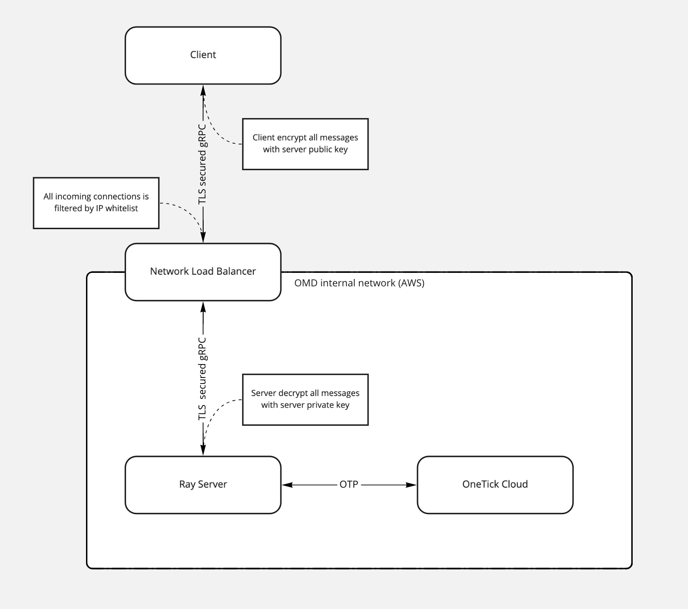

.. _ray-remote:

Remote OTP with Ray
===================

Ray is a distributed execution framework for Python, and you can run ``onetick.py`` code remotely on your dedicated Ray instance,
without need to installing OneTick binaries locally.

Remote OTP Concepts
:::::::::::::::::::

Although, it isn't possible to use ``onetick.py`` without OneTick installation and its binaries,
but it is still possible to run ``onetick.py`` code remotely on Ray instance, while developing locally in your preferable IDE or Jupyter.

Each request to Ray server needs to be done in initialized context:
::

    import ray
    ray.init()

To ``onetick-py`` code you need to locate it inside some function,
which in turn must be decorated with ``@ray.remote(max_retries=1)`` decorator to become so called "remote function".
Argument ``max_retries=1`` is good to avoid retrying for failing calls of remote function,
which is most probable will be caused by mistakes in your ``onetick.py`` code.
::

    import onetick.py as otp

    @ray.remote(max_retries=1)
    def example_otp_code():
        # here your OTP code goes
        ...
        return results

Following code runs remote function on Ray instance and return the results.
::

    result = ray.get(example_otp_code.remote())

When you finish, it is **necessary to shutdown your Ray connection** (don't forget to do it, as it is could lead to memory consumption on Ray server):
::

    ray.shutdown()
