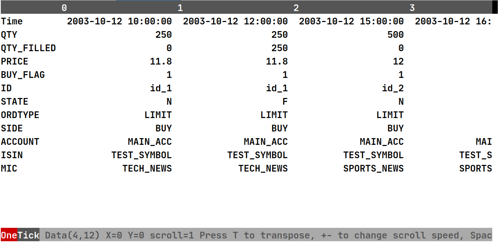

.. _debugging:

Debugging
=========

Here we would like to describe possible techniques that could help you to find and understand issues in your code.

Show stack trace
----------------

We provide ability to show line of code where the issue happens in case if code is written in `onetick.py`.

In code your set or :class:`otp.config['show_stack_info'] <onetick.py.configuration.Config>` or the ``OTP_SHOW_STACK_INFO`` env variable to enable this option (more about it is :ref:`here <static/configuration/root:Configuration>`)

In tests your could use the ``--show-stack-trace`` :ref:`option <show stack trace flag>`.

Dumping ticks
-------------

The :meth:`.dump() <onetick.py.Source.dump>` method allows to print out incoming ticks, that might help to find
ticks that leads to incorrect behaviour and reproduce it then in tests.

onetick view
------------

``onetick view`` is a terminal UI for browsing OneTick databases and their content.

This tool is built on top of the ``onetick.py`` and distributed
as a separate python package.

.. only:: Internal

    ``onetick view`` is located in the
    `onetick-ext-view <https://gitlab.sol.onetick.com/solutions/py-onetick/onetick-ext-view>`_ project
    on our Gitlab server.
    You can find all usage instructions in the
    `README.md <https://gitlab.sol.onetick.com/solutions/py-onetick/onetick-ext-view/-/blob/master/README.md>`_ file.

    ``onetick view`` can be installed with ``pip``:

    ::

        pip install onetick-ext-view

After installation a developer just needs to go to a folder with OneTick databases
and execute the ``onetick view`` command in terminal -- it automatically discovers
databases and shows them.

You can also connect to remote Tick Server by specifying it's address via `--remote-ts` argument.

Usually it's convenient to use this tool along with the ``--keep-generated`` :ref:`flag in tests <keep generated flag>`,
because this flag provides all databases are used in tests with their content.

Save OTQ
--------

Any :class:`otp.Source <onetick.py.Source>` object has the :meth:`.to_otq() <onetick.py.Source.to_otq>` method that allows to save a query on the disk with goal to check the OTQ graph.
Note that this method has symbols and start/end query interval parameters that's better to pass there the same as for :func:`otp.run <onetick.py.run>` because these parameters could change graph calculation.

It's often useful when you think the ``onetick.py`` constructs the wrong calculation or you want to check some details.

Setting name of the query
-------------------------

Method :meth:`otp.Source.set_name <onetick.py.Source.set_name>` can be used to set the name of the source.
This name will be used as a part of the resulting .otq file name and as the name of the query inside this file.

Graph rendering
---------------

Alternatively we could propose to use the :meth:`.render_otq() <onetick.py.Source.render_otq>` method
on the :class:`otp.Source <onetick.py.Source>` or :func:`render_otq <onetick.py.utils.render_otq>` function
on an `otq` file, which draws a query as `PNG` or the :graphviz:`graphviz <>` DAG.
It could help with quick investigations because save OTQ requires a running tick server and connected to it OneTick client with necessary context.

You can also try to use :meth:`.render() <onetick.py.Source.render>` method
of the :class:`otp.Source <onetick.py.Source>`, however it produces less useful output.

Logging symbols
---------------

Configuration parameter :py:attr:`otp.config.log_symbol<onetick.py.configuration.Config.log_symbol>`
and parameter ``log_symbol`` of function :py:func:`otp.run <onetick.py.run>` can be used to enable
printing of each processed symbol to the standard output.

Note that this method has some limitations:

- In this case function :py:func:`otp.run <onetick.py.run>` is called in callback mode,
  thus it doesn't return pandas.DataFrame or other object.
- This only works with unbound symbols, so it will not work
  if :py:func:`otp.merge <onetick.py.merge>` is used to merge symbols into one flow.
